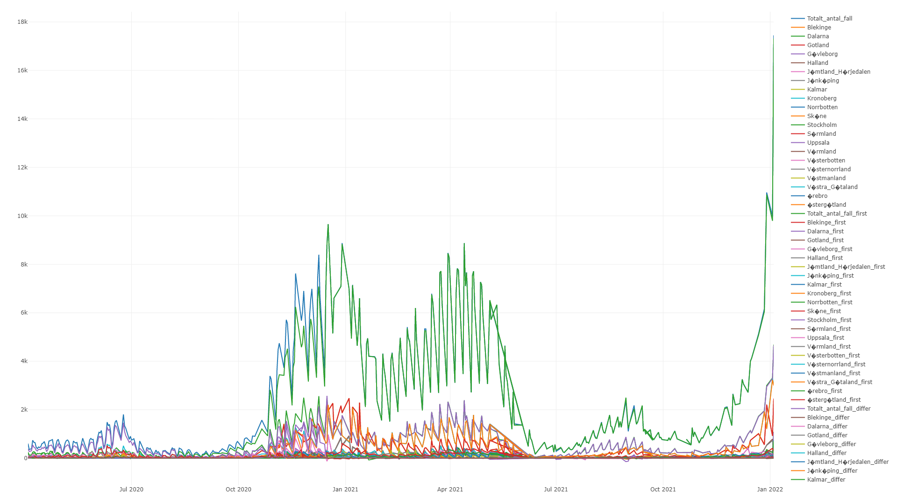
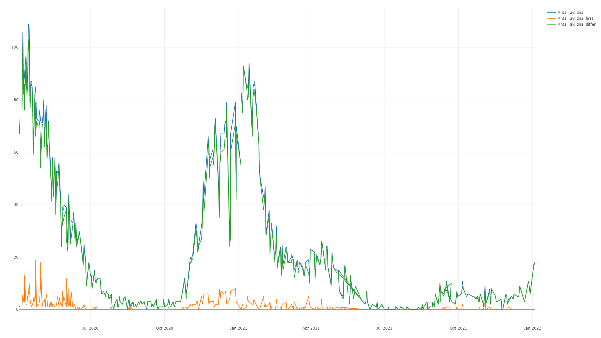
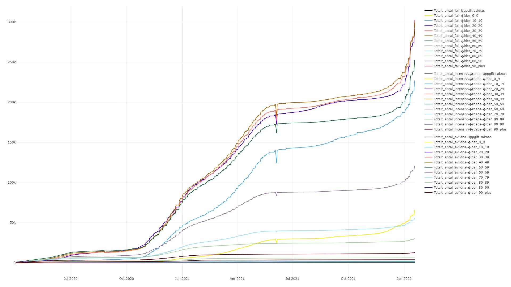
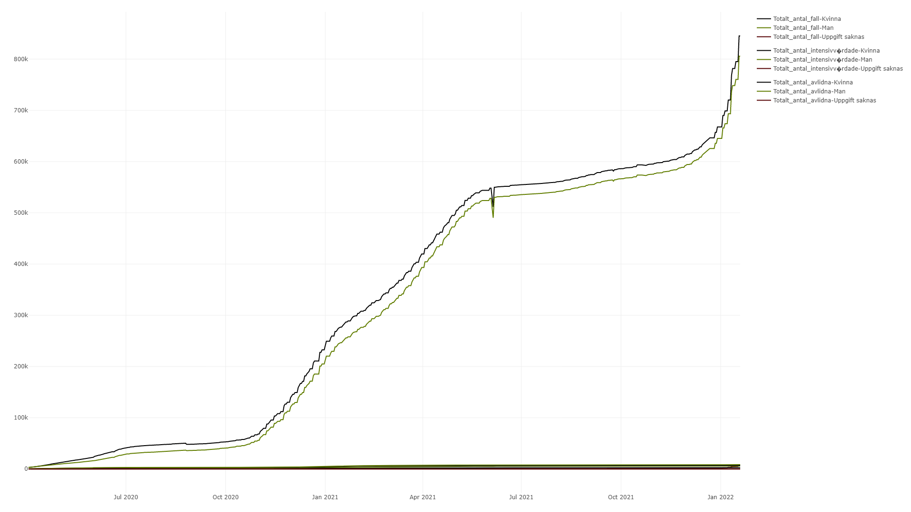
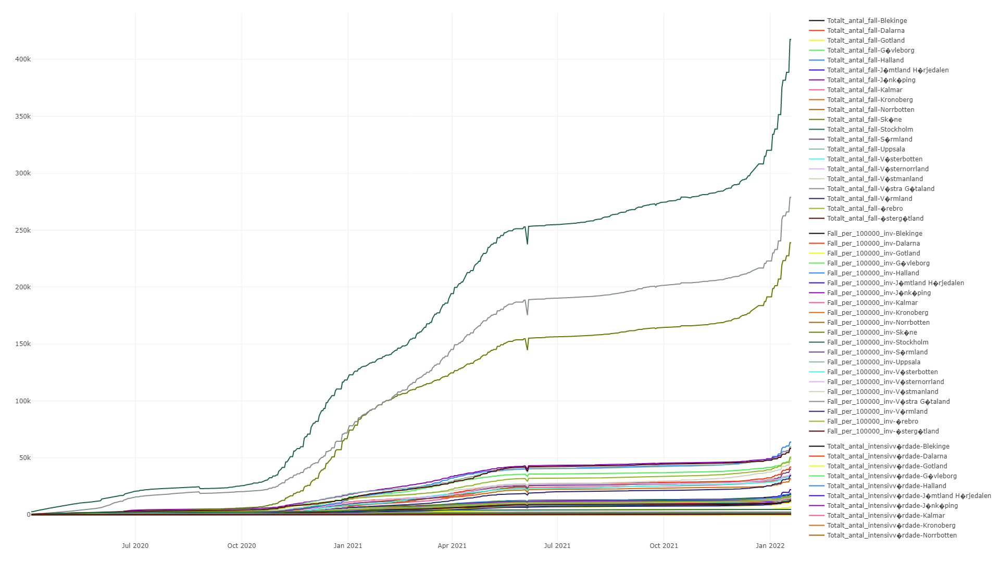
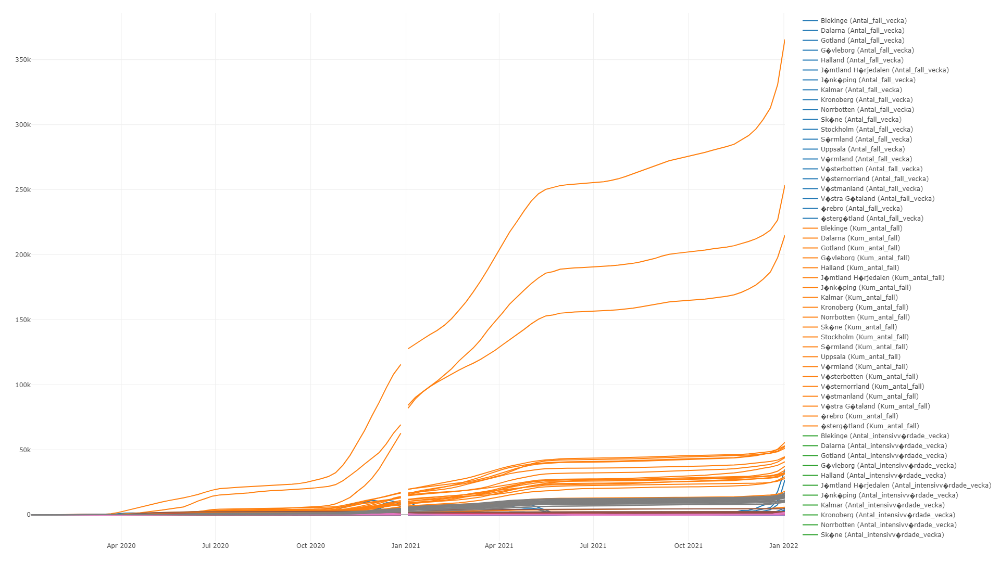
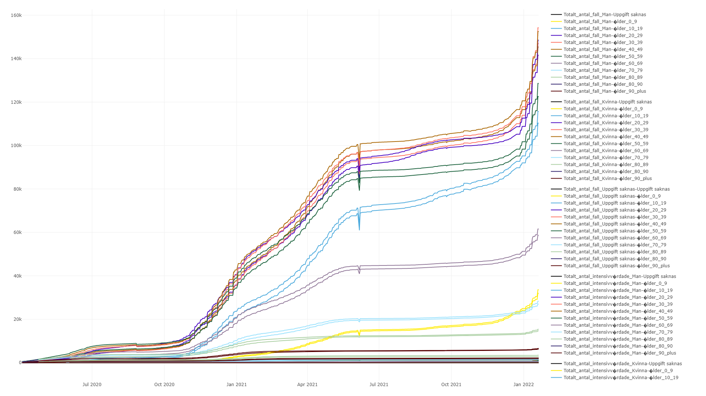
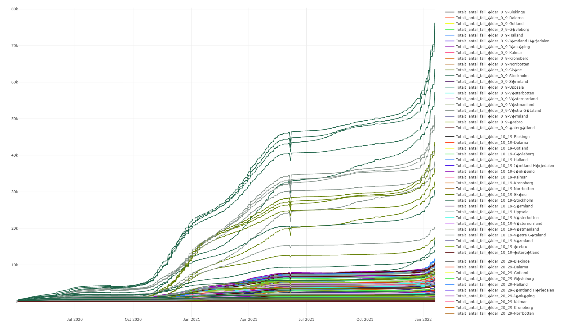
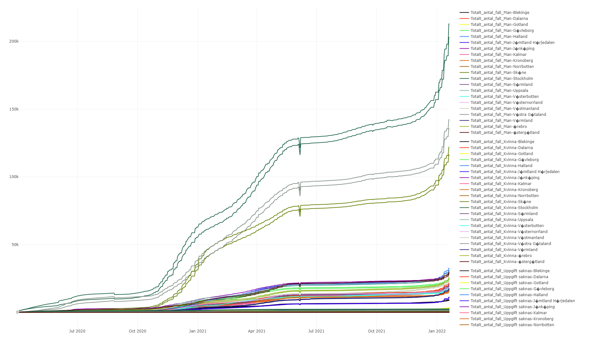

```{r setup, include=FALSE}
knitr::opts_chunk$set(echo = TRUE)
```

\newpage

# Introduction

The first part of the project is to download (appropriately naming) Folkhalsomyndigheten’s daily (for those days that it was provided) excel spreadsheet report concerning COVID19 in Sweden from Wayback machine. Then, to design a database (in R) that stores all the the information in those sheets, implement a program (R) that reads in all of the sheets. The program should read these sheets from a given directory on the hard drive. The program should be flexible in the sense to read all the files in the given directory, not have the file names hardcoded, as new files can be added at a later stage. The database and program have to be flexible as sheet names in the excel files evolve, e.g. new ones are added can be renamed. They should be flexible for the future if FHM adds new, renames, removes sheets. The R database should be designed in such a way that is easy to use, with unproblematic extraction of the data from it. As part of the final report the downloaded spreadsheets and all the R code need to be handed-in as publicly available data and R package on GitHub or CRAN.

# Data Access

The data is downloaded from Folkhalsomyndigheten’s daily excel spreadsheet report concerning COVID19 in Sweden from Wayback machine. In order to access the data, here we used a python script which implemented by a package called selenium[@selenium]. The selenium we used in this project is the Selenium WebDriver. This is a kind of browser-based automation test suite, which allows python scripts to run the automation tests like mouse-clicking, etc. by locating the XPath elements of the website, etc.

In this paper, we would use the chrome driver(version 96.0.4664.45, based on Chrome 96.0.4664.110) which download from Chrome Driver's official website[@ChromeDriver], which is the webdriver for Chrome.

## Config
Before running the main script, we first need to do some settings in the config.py file.

```{bash eval=FALSE, include=TRUE}
# Config.py

# Location of chrome driver
chrome_driver = r"C:\Program Files (x86)\Google\Chrome\Application\chromedriver.exe"

# Url for Wayback Machine
Wayback_Machine_URL = 'https://web.archive.org/'

# Target URL
Target_URL = ('https://www.folkhalsomyndigheten.se/smittskydd-beredskap/utbrott/aktuella-utbrott/covid-19/'
              'bekraftade-fall-i-sverige',
              'https://www.folkhalsomyndigheten.se/smittskydd-beredskap/utbrott/aktuella-utbrott/covid-19/' \
             'statistik-och-analyser/bekraftade-fall-i-sverige/')

# Define the start date and final date
start_date = 'APR 04 2020'
final_date = 'DEC 28 2021'

# Download directory
Download_directory = r'G:\LiU\732A76_Research_Project\data'

```

In this file, we need to set the location of the Chrome webdriver first, which helps python scripts to run the webdriver. Besides, we set the URL for the Wayback Machine and the URL for the Folkhalsomyndigheten in order to get the files from the past. Then, we set the start and end dates of the files we need, which are in form of 'MON DAY YEAR'. At last, we set the download directory for the files.

## Data file downloads

After finishing the setting of configs.py, we just run the 'main.py' file so that the download would start. The process of the downloads(in PyCharm IDE) would be like this 

```{bash eval=FALSE, include=TRUE}
Jan 02 2022 - 23:25:14, Start to downloading files
Jan 02 2022 - 23:26:18, Finished downloading of the file in Sep 17 2021
Jan 02 2022 - 23:27:20, Finished downloading of the file in Sep 18 2021
```


If there is no data at that date or failed the downloads, the script would shows like this

```{bash eval=FALSE, include=TRUE}
Jan 02 2022 - 23:25:14, Start to downloading files
Jan 02 2022 - 23:26:18, failed to download the file in Sep 17 2021
Jan 02 2022 - 23:27:20, No file could be download in Sep 18 2021
```

Each download may take about 1 minute, which depends on the network situation. The total time used in downloading the files from APR 03 2020 to DEC 28 2021 takes about 10 hours to download.

.PNG)


# Data Proccessing

After we get the data files like above, we start to do the process these data by R script.

The required packages for the script are below:
```{r eval=FALSE, include=TRUE}
library(readxl)
library(tidyverse)
library(plotly)
library(config)
library(htmlwidgets)
```


## Config

Before starting the process of data we need to do the config.yml.

```{bash eval=FALSE, include=TRUE}
default:
  start_time: "2020/04/03"
  end_time: "2021/12/30"
  file_add_and_name: './data/Folkhalsomyndigheten_Covid19_'
  file_type: '.xlsx'
  # Sheet type
  Antal per dag region: !!seq [1,1,2,23]
  Antal avlidna per dag: !!seq [1,1,2,2]
  Antal intensivvårdade per dag: !!seq [1,1,2,2]
  Totalt antal per region: !!seq [2,1,2,5]
  Totalt antal per kön: !!seq [2,1,2,4]
  Totalt antal per åldersgrupp: !!seq [2,1,2,4]
  Veckodata Region: !!seq [3,3,4,11]
  Veckodata Kommun_stadsdel: !!seq [3,6,7,10]
  Veckodata Riket: !!seq [3,0,3,13]
  # Combined sheet
  Antal per dag region_on_kön: !!seq [4,0,4,5]
  Antal per dag Åldersgrupp_on_kön: !!seq [4,0,6,5]
  Antal per dag region_on_Åldersgrupp: !!seq [4,0,4,6]
```

We first set the start/end date of the file we download, then set the file address and the name, then of course the file type. In this case, the file address with time sequence would create automatically like this "./data/Folkhalsomyndigheten_Covid19_Apr 03 2021.xlsx" later.

About sheet type, here we have defined 4 types of sheets according to the current data. For now, I would first explain what these sequences doing. The first digit stands for the type of the sheets, the second letter stands for the column of time/label depending on the type of sheet. The third letter stands for the start column of the data, and the fourth letter stands for the end of the data. 

For example, Antal per dag region: !!seq [1,1,2,23], means it is a type 1 sheet, and the time column is in the first column, the data we need starts from the second column to the twenty-third column.

## Data reading


### Type 1 sheet
According to the settings: Antal per dag region: !!seq [1,1,2,23]

The sheet (Antal per dag region) is a kind of type 1 sheet, with time sequence columns and data columns.


After relative processing, we could get the data frame with the 1st column as a time column, and the rest 2nd to 23rd column as data.


\newpage

### Type 2 sheet

According to the settings, Totalt antal per kön: !!seq [2,1,2,4]

the sheet (Totalt antal per kön) is a kind of type 2 sheet, with only data.


In this case, the second letter does not stand for a time, but the label. Then we just add one column(Date of the file) to the data frame as below, then combine these data into one named final_Totalt_antal_per_region.


\newpage

### Type 3 sheet

For type 3, there are two types of data, but both of them are the same for the time part with year column and week column

First, the sheet like Veckodata Region contains the week data and multiple labels(like KnKod, etc.)


So according to the setting Veckodata Kommun_stadsdel: !!seq [3,6,7,10], choose the chosen label column and data columns as below.


Then for the sheet like Veckodata_Riket, it only contains the time(year and week) column and data columns, in this case, we set the second letter as 0. 


So according to the settings, Veckodata Riket: !!seq [3,0,3,13], we could get the data like below


\newpage

### Type 4 sheet

For the type 4 sheet, it means the combined sheet, which takes the main sheet as base then using the data from other sheet(vice sheet) as a reference to create new data groups, for example, like Antal per dag Åldersgrupp_on_kön: !!seq [4,0,6,5]

In this sheet(Antal per dag Åldersgrupp_on_kön), we use sixth sheet(Totalt antal per åldersgrupp) as the main sheet, and use fifth sheet (Totalt antal per kön) as vice sheet. In this case, the main data is based on the Totalt antal per åldersgrupp


Then combined the data with the vice sheet(Totalt antal per kön), which provides the rates of different sex takes, which means we could get the data of Totalt_antal_fall, Totalt_antal_intensivvårdade and Totalt_antal_avlidna with different sex and age group.


\newpage


## Output

After finishing processing the data, we would use the package plotly to do the visualization. Then save the plots in form of HTML, for example Antal_per_dag_region




\newpage

# Result Anlysis


## Antal_avlidna_per_dag



According to the plot, we could find that the number of the death per day presents as a seasonal like data, which takes two peaks in Apr 2020 and Jan 2021. But the third peaks does appear in Oct 2021. Besides, the number of death per day is kind of relative to the weather, for example, it gets lower value from Apr to Oct, which is summer time and gets higher value from Oct to Jan when the temperature gets lower.

\newpage

## Antal_per_dag_region


According to the plot, we could find that the number of cases per day presents a seasonal like data, which from Oct 2020 to Oct 2021. The peeks occurs from Oct 2020 to Apr 2021, but there is a trough in the middle from Jan 2021 to Mar 2021.


By filtering the low value, we could find that the most cases takes place in Skane, Stockholm and Vastra Gotaland.

\newpage

## Antal_intensivvårdade_per_dag


According to the plot, we could find that the number of intensive care per day presents a data without any seasonal, which the peaks occurs in May 2020, Dec 2021 and Apr 2021. This data is similar to the data of [Antal_avlidna_per_dag] from Apr 2020 to Mar 2021, but from Apr 2021 it turns to a different trend by comparing with the [Antal_avlidna_per_dag]. This may caused by the [Antal_per_dag_region] peaks at Apr 2021.

\newpage

## Totalt_antal_per_åldersgrupp



According to the plot, we could find that for all the age group, the trend of total number of cases is growing up. Besides, the people in age group 20-59 takes most cases, and the age group 10-19 and age group  take the middle value and the age group 70-90 plus and 0-9 stays in a low value for a long time.

As for number of intensive care per day, most people are in age from 10-39.

As for number of death per day, most people are in age from 70-90 plus.

\newpage

## Totalt_antal_per_kön



According to the plot, we could find that the woman take more risk of getting effected than the man.

But the death rate and the intensive care rate the man is lower the woman.

\newpage

## Totalt_antal_per_region



According to the plot, we could find that the trend of the data is similar to the data we mentioned previously, for example, like number of cases, most cases takes place in Skane, Stockholm and Vastra Gotaland,etc. 


But for per 100000 infected, the rate of most regian are the same.


As for total number of intensive care, it has the same rate as number of cases does, which means most cases takes place in Skane, Stockholm and Vastra Gotaland.


As for total number of death, it is also Skane, Stockholm and Vastra Gotaland take the top 3 rates.

\newpage

## Veckodata_Kommun_stadsdel


It is hard to find anything in this plot.

\newpage

## Veckodata_Region




This plot is similar to the Antal_per_dag_region.

\newpage

## Veckodata_Riket


The trend of data in this plot are same to the other plots.

\newpage

## Antal_per_dag_Åldersgrupp_on_kön



Based on the result of Totalt_antal_per_åldersgrupp, we could find that for each age group, the woman take the most part.

\newpage

## Antal_per_dag_region_on_Åldersgrupp



Based on the result of Totalt_antal_per_region, we could find that for each region, the age group 40-49 take the most part.

\newpage

## Antal_per_dag_region_on_kön.html



Based on the result of Totalt_antal_per_region, we could find that for each region, the woman take the most part.


# Appendix


All code and files is uploaded in the Github.

Data access

https://github.com/ChenjianS47/WayBackMachine_FHM_COVID-19_statistics

Data process

https://github.com/ChenjianS47/FHMs_daily_COVID-19_reports

# References


